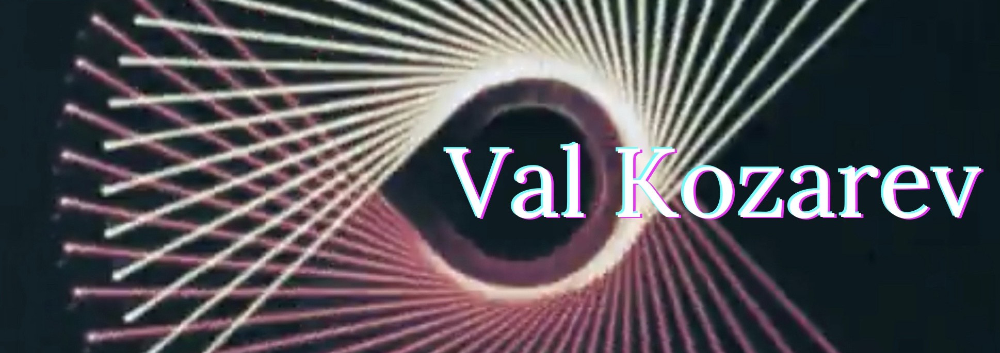

### Hi there 👋

Welcome to my page! My name is Val and I am, among other things, a software developer. I am interested in learning new frameworks, developing interesting and beautiful applications, and making technology accessible to as many people as possible. Check out my profile to see some cool personal projects that I've been working on, I've pinned a few of my favorites below :)

## :computer: Technical Skills

